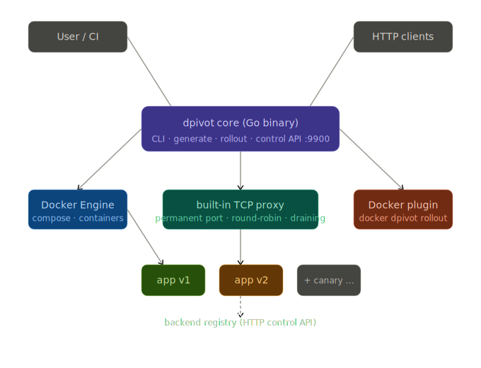

# dpivot

> Zero-downtime deployments for Docker Compose — no Kubernetes, no Traefik, no external proxy.

[](go.mod)
[](LICENSE)
[]()
[]()

`dpivot` is a single Go binary you drop next to your existing `docker-compose.yml`. It injects its own built-in TCP proxy, writes a new `dpivot-compose.yml`, and from that point your host port **never goes dark again** — not during deployments, not during container restarts.

No sidecar. No service mesh. No changes to your app.

---

## The problem it solves

When you run `docker compose up --force-recreate web`, Docker stops the old container and then starts the new one. That gap — usually under a second — is enough to drop HTTP connections, fail health checks in load balancers, and kill WebSocket sessions.

The standard fix is to add Traefik or nginx as a reverse proxy. That means learning new config formats, dealing with labels, and adding more moving parts to your stack.

dpivot takes a different approach. It puts a tiny proxy in front of your service that **owns the host port permanently**. Your service becomes a backend behind that proxy. When you deploy a new version, the proxy routes traffic to the new container while the old one drains — and your clients never notice.

---

## Quick start (5 minutes)

```bash
# 1. Build the dpivot binary
git clone https://github.com/dpivot/dpivot.git
cd dpivot
make build
# binary is now at ./bin/dpivot

# 2. Try the included test app
cd examples/testapp
cp .env.example .env
docker compose build
../../bin/dpivot generate
docker compose -f dpivot-compose.yml up -d

# 3. Open the UI at http://localhost:3000
# You'll see a live version monitor bar

# 4. Simulate a rollout — bump the API version and deploy
API_VERSION=2.0.0 docker compose build api
API_VERSION=2.0.0 ../../bin/dpivot rollout api \
  --file dpivot-compose.yml \
  --control-addr http://localhost:9901

# Watch the "api version" badge in the browser flip from 1.0.0 → 2.0.0
# Zero connections dropped.
```

That's the whole workflow. For a full walkthrough, see [docs/getting-started.md](docs/getting-started.md).

---

## How it works



You give dpivot your original compose file:

```yaml
# docker-compose.yml — your existing file, unchanged
services:
  web:
    image: myapp:1.0
    ports:
      - "3000:3000"
  db:
    image: postgres:16
    environment:
      POSTGRES_PASSWORD: secret
```

Run `dpivot generate`. It reads each service and applies four rules in priority order:

1. Has `x-dpivot: skip: true` → pass through unchanged
2. No `ports` declared → pass through (workers, sidecars, etc.)
3. Image is a known database → pass through with a warning
4. Has `ports`, not a database → inject proxy

```
Parsed 2 service(s) — 1 eligible for proxy injection

dpivot Transform Summary:
  ✓ Enabling zero-downtime for service 'web'
  ⚠ Skipped 'db' (known database image)

Generated: dpivot-compose.yml
```

The generated file rewires things so the proxy permanently owns the host port:

```
Client :3000 → dpivot-proxy-web (permanent) → web:3000 (replaceable)
```

When you run `dpivot rollout web`, it:

1. Starts a second `web` container
2. Waits for its healthcheck to pass
3. Registers the new container with the proxy (`POST /backends`)
4. Marks the old container as draining — no new connections
5. Waits for in-flight requests to finish
6. Stops and removes the old container

Your clients see nothing. The proxy never dropped the port.

---

## Installation

**Build from source:**

```bash
git clone https://github.com/dpivot/dpivot.git
cd dpivot
make build
# binary at ./bin/dpivot — add to your PATH or call directly
```

**As a Docker CLI plugin (run as `docker dpivot ...`):**

```bash
sudo make install-plugin
# installs to /usr/local/lib/docker/cli-plugins/docker-dpivot
```

**Verify it works:**

```bash
dpivot version
# dpivot 0.1.0

dpivot --help
```

---

## Commands

### `dpivot generate`

Reads your `docker-compose.yml` and writes `dpivot-compose.yml`. Your original file is never touched.

```bash
dpivot generate
dpivot generate --file docker-compose.prod.yml --output dpivot-compose.prod.yml
```

| Flag | Default | Description |
|------|---------|-------------|
| `--file`, `-f` | `docker-compose.yml` | Input compose file |
| `--output`, `-o` | `dpivot-compose.yml` | Output file path |

---

### `dpivot rollout <service>`

Zero-downtime deploy for a named service. Build your new image first, then run this.

```bash
dpivot rollout web --file dpivot-compose.yml --control-addr http://localhost:9901
dpivot rollout web --pull --timeout 120s --drain 10s
```

| Flag | Default | Description |
|------|---------|-------------|
| `--file`, `-f` | `dpivot-compose.yml` | dpivot compose file |
| `--control-addr` | `http://localhost:9900` | Proxy control API address |
| `--pull` | `false` | Pull latest image before starting |
| `--timeout`, `-t` | `60s` | How long to wait for the new container's healthcheck |
| `--drain`, `-d` | `5s` | How long to let in-flight requests finish on the old container |
| `--api-token` | `$DPIVOT_API_TOKEN` | Bearer token if you secured the control API |

> **Finding the right `--control-addr`:** By default, dpivot maps each proxy's control port to the host at `service_host_port + 6900`. So if your service runs on port `3001`, the control API is at `http://localhost:9901`. If it runs on port `3000`, it's at `http://localhost:9900`.

---

### `dpivot rollback <service>`

If something went wrong after a rollout, this restores traffic to the previous version without redeploying.

```bash
dpivot rollback api --control-addr http://localhost:9901
```

Rollback reads the state file dpivot saved during the last rollout (`/tmp/dpivot-<service>-state.json`). If that file is gone, rollback can't run — deploy the previous image manually instead.

---

### `dpivot status`

Shows the current backends registered with the proxy.

```bash
dpivot status --control-addr http://localhost:9901
```

---

### `dpivot version`

```bash
dpivot version
# dpivot 0.1.0
```

---

## Using as a Docker CLI plugin

After `sudo make install-plugin`, every dpivot command works through the Docker CLI:

```bash
docker dpivot generate
docker dpivot rollout web --control-addr http://localhost:9901
docker dpivot status
docker dpivot --help
```

The plugin binary is identical to the standalone `dpivot` binary — mode is auto-detected from `argv[0]`.

---

## Opting a service out

Add `x-dpivot: skip: true` to keep a service exactly as-is. No proxy will be injected.

```yaml
services:
  admin:
    image: myapp:latest
    ports:
      - "9000:9000"
    x-dpivot:
      skip: true
```

The `x-dpivot` block is stripped from the generated file so Docker never sees it.

---

## Multi-port services

Multiple ports work natively — one proxy listener per port:

```yaml
services:
  frontend:
    image: nginx:alpine
    ports:
      - "80:80"
      - "443:443"
```

The proxy gets both `80:80` and `443:443`. Both stay live during rollouts.

---

## Databases are always excluded

dpivot never proxies these images — they're stateful and a TCP proxy in front of them causes more problems than it solves:

`postgres`, `mysql`, `mariadb`, `redis`, `mongo`, `elasticsearch`, `opensearch`,
`cassandra`, `couchdb`, `influxdb`, `rabbitmq`, `kafka`, `zookeeper`,
`mssql`, `clickhouse`, `minio`, `vault`

Matching strips registry prefixes and tags — `docker.io/library/postgres:16` and `bitnami/postgres:latest` both match. If dpivot auto-detects your service as a database but you want to proxy it anyway, use `x-dpivot: skip: false` is not enough — the detector takes priority. You'd need to contribute a flag to override it.

---

## The proxy control API

Each `dpivot-proxy-<service>` container runs a small HTTP API for backend management. This is what `dpivot rollout` calls internally, but you can use it directly from scripts.

The control port is mapped to your Docker host at `service_host_port + 6900`:
- Service at `:3000` → control API at `http://localhost:9900`
- Service at `:3001` → control API at `http://localhost:9901`
- Service at `:8080` → control API at `http://localhost:14980`

| Method | Path | Description |
|--------|------|-------------|
| `GET` | `/health` | Liveness check |
| `GET` | `/backends` | List all backends with request counts |
| `POST` | `/backends` | Register a new backend |
| `PUT` | `/backends/{id}/drain` | Stop sending new connections to a backend |
| `DELETE` | `/backends/{id}` | Remove a backend |

Full reference: [docs/control-api.md](docs/control-api.md)

---

## Examples

| Example | What it demonstrates |
|---------|---------------------|
| [`examples/testapp/`](examples/testapp/) | Full working app with live rollout monitor in the browser |
| [`examples/basic/`](examples/basic/) | Minimal single-service setup |
| [`examples/advanced/`](examples/advanced/) | Multi-service stack with `x-dpivot: skip` |
| [`examples/multi-port/`](examples/multi-port/) | Multiple host ports on one service |
| [`examples/production/`](examples/production/) | Nginx + TLS + Prometheus in front of dpivot |
| [`examples/scripts/`](examples/scripts/) | Safe rollout script with auto-rollback on error |

---

## Documentation

| Doc | Description |
|-----|-------------|
| [docs/getting-started.md](docs/getting-started.md) | Step-by-step guide from zero to first rollout |
| [docs/how-it-works.md](docs/how-it-works.md) | What happens internally during generate and rollout |
| [docs/control-api.md](docs/control-api.md) | HTTP control API reference |
| [docs/configuration.md](docs/configuration.md) | All flags and environment variables |

---

## Comparison with alternatives

|  | docker-rollout | Dokku | **dpivot** |
|--|---------------|-------|-----------|
| Works with existing `docker-compose.yml` | ✅ | ❌ | ✅ |
| No external proxy required | ❌ needs Traefik | ❌ built-in nginx | ✅ built-in |
| Host port stays live during rollout | ❌ | ✅ | ✅ |
| HTTP backend management API | ❌ | ❌ | ✅ |
| Database auto-exclusion | ❌ | ❌ | ✅ |
| No root/server required | ✅ | ❌ | ✅ |
| Docker CLI plugin | ❌ | ❌ | ✅ |

docker-rollout documents that it requires Traefik or nginx-proxy already running. dpivot includes the proxy, so you don't need to bring your own.

---

## Building

```bash
make build              # ./bin/dpivot
make test               # go test -race ./...
make docker-build       # technicaltalk/dpivot-proxy:latest
make install-plugin     # /usr/local/lib/docker/cli-plugins/docker-dpivot
make lint               # golangci-lint run
```

---

## Technical notes

- **TCP proxy:** pure `net` package, no CGO, no system dependencies
- **Round-robin:** lock-free `atomic.Uint64` counter, deterministic backend ordering
- **Registry:** `sync.RWMutex` + heap-allocated `*atomic.Uint64` per backend (race-safe struct copies)
- **Port ownership:** listener opened once at `docker compose up`, never closed during rollouts
- **Half-close:** bidirectional `io.Copy` with `CloseWrite()` for correct TCP teardown
- **Tests:** 71 unit tests, race detector clean

---

## License

MIT. See [LICENSE](LICENSE).
